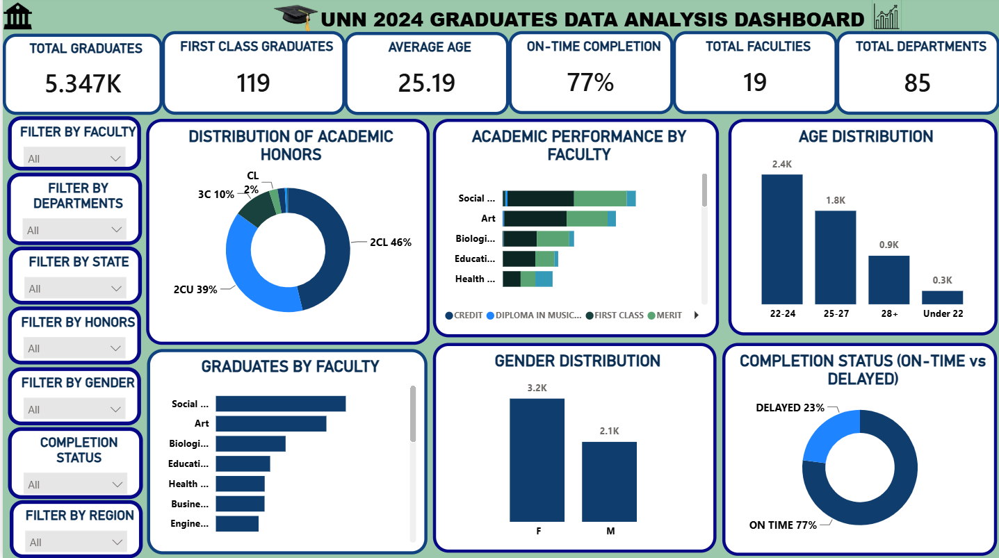
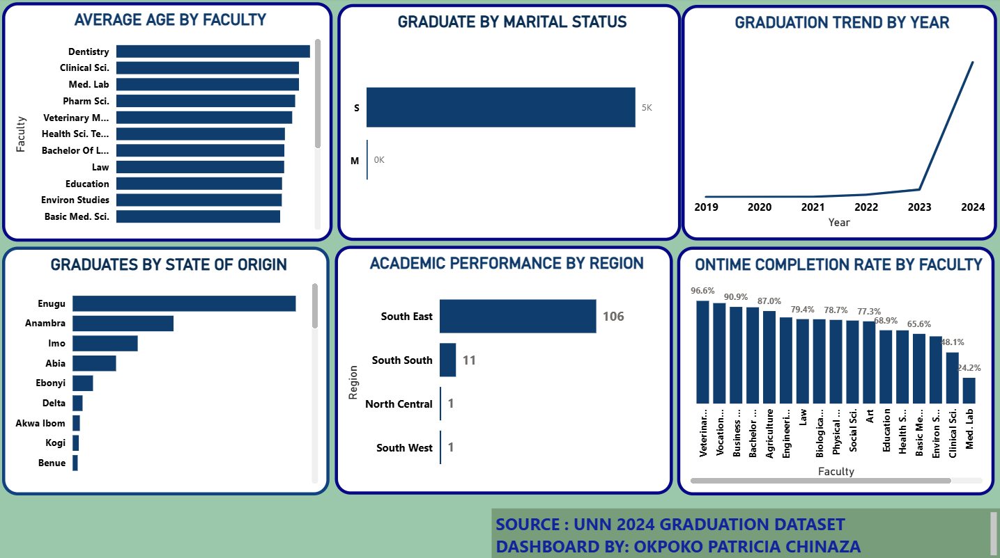
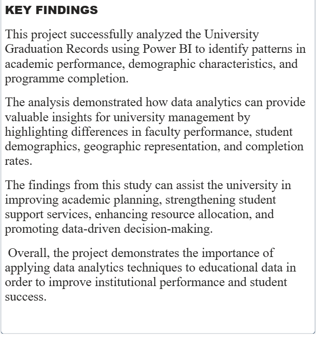

# UNN 2024 Graduation Analysis Dashboard

## Project Overview

This project analyzes the 2024 graduation records of the University of Nigeria, Nsukka (UNN). The goal was to clean, transform, analyze, and visualize the data using Excel, Power Query, DAX, and Power BI to provide insights into graduation trends, academic performance, and student demographics.

## Business Objective

To transform raw graduation data into an interactive dashboard that supports data-driven decision-making by identifying trends in graduation performance across faculties, departments, gender, and states of origin.

## Tools Used

- Microsoft Excel
- Power BI
- Power Query
- DAX

## Skills Demonstrated

- Data Cleaning
- Data Transformation
- Exploratory Data Analysis (EDA)
- Data Visualization
- Dashboard Development
- KPI Reporting
- DAX Measures

## Dashboard Features

- Total Graduates
- Graduation by Faculty
- Graduation by Department
- Gender Distribution
- Honors Classification
- State of Origin Analysis
- Age Distribution
- On-Time Completion Rate
- Academic Performance
- Average Age

## Key Insights

- Compared graduation performance across faculties and departments.
- Analyzed gender distribution among graduates.
- Visualized honors classifications and completion rates.
- Identified trends in students' states of origin.
- Built interactive dashboards using slicers and KPIs.

## Repository Contents

## Dashboard Preview

### Dashboard Overview

### Academic Performance Analysis

### Gender & Faculty Analysis

### Key Findings

> **Note:** The original dataset is not included in this repository to protect student privacy and confidential information

## Author

**Okpoko Patricia Chinaza**
**Data Analyst**
